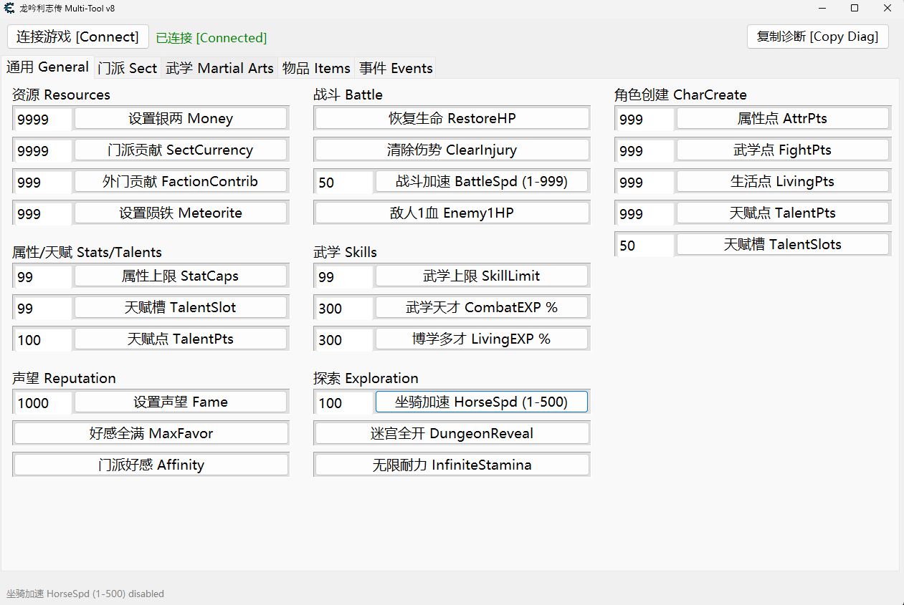
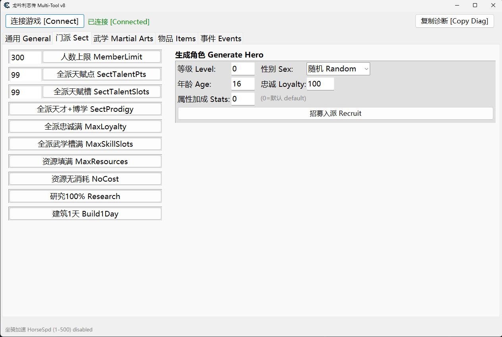
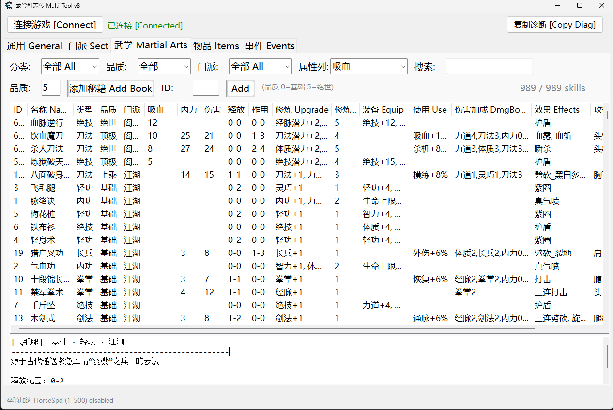
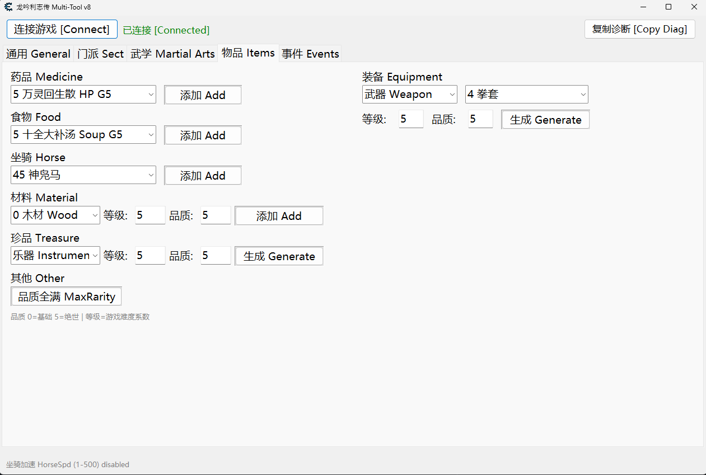
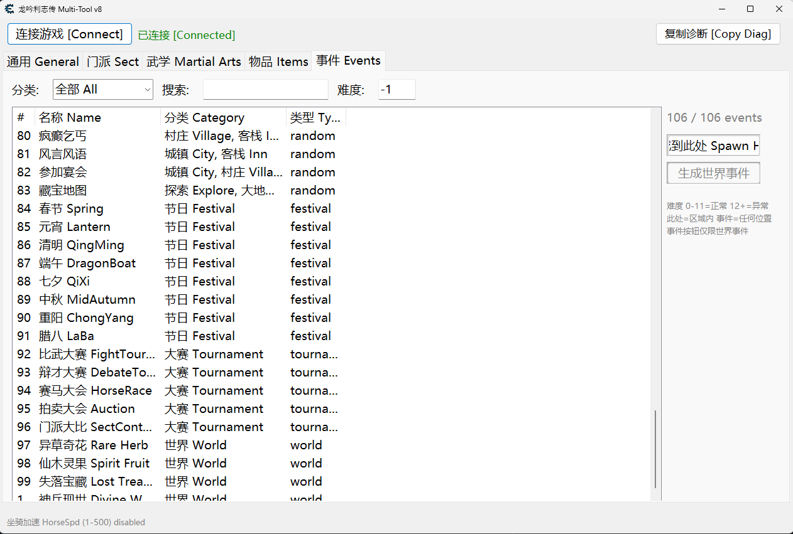

# LongYinLiZhiZhuan Cheat Table (龙胤立志传 修改器)

A form-based Cheat Engine table for **LongYinLiZhiZhuan** (龙胤立志传), a martial arts RPG built on Unity IL2CPP.

All cheats are accessed through a Multi-Tool form with 5 tabs. Bilingual UI (Chinese + English).

## Screenshots

### General Tab
Resources, stats, talents, skills, battle, exploration, reputation, and character creation cheats.



### Sect Tab
Sect-wide management: member limit, talent/skill slots, loyalty, resources, research, buildings, and hero generation.



### Martial Arts Tab
Searchable database of 989 skills with sorting, filtering by category/rarity/sect, dynamic stat columns, and one-click book adding.



### Items Tab
Add medicine, food, horses, materials, equipment (with sub-type selection), treasures, and max rarity.



### Events Tab
Browse and spawn 106 game events with category filter, search, and difficulty control.



## Features

### General
- Set Money, Sect Currency, Faction Contribution, Meteorite
- Stat Caps, Talent Slots, Talent Points
- Fame, NPC Favor, Faction Affinity
- Skill Limit, Combat EXP%, Living EXP%
- Restore HP, Clear Injuries
- Battle Speed, Enemy 1HP
- Horse Speed, Dungeon Reveal, Infinite Stamina
- Character Creation: Attribute/Fight/Living Points, Talent Points & Slots

### Sect Management
- Member Limit (bypass cap)
- Sect-wide: Talent Points, Talent Slots, Prodigy, Loyalty, Skill Slots
- Max Resources, No Cost, Instant Research, Instant Buildings
- Generate Hero (custom level, sex, age, loyalty, stats)

### Martial Arts
- 989 skills with full stat display
- Filter by category, rarity, sect
- Sort by any column including dynamic stat columns
- Add skill books by selection or ID

### Items
- Medicine, Food, Horse (from game database)
- Materials (type + level + rarity)
- Equipment (category + sub-type from game database + level + rarity)
- Treasures (type + level + rarity)
- Max Rarity (upgrade all items to highest quality)

### Events
- 106 events (random + festivals + tournaments)
- Filter by category, search by name
- Spawn Here (in current area) or Spawn Event (world events)
- Custom difficulty

## Requirements

- [Cheat Engine 7.6+](https://cheatengine.org)
- LongYinLiZhiZhuan (Steam)

## Usage

1. Open Cheat Engine, attach to `LongYinLiZhiZhuan.exe`
2. Load `LongYinLiZhiZhuan.CT`
3. Enable "Open Multi-Tool" in the address list
4. Click "Connect" in the Multi-Tool form
5. Use the tabs to access cheats

## Troubleshooting

**Make sure you load a save before clicking Connect.** The title screen does not have the game data needed — you must be in-game.

If you see an error when loading the CT or opening the Multi-Tool:

1. **Close CE completely** (not just reload) → reopen → load CT again
2. If the error persists, copy diagnostic info using one of these methods:
   - **In the address list**: enable **"复制加载诊断 [Copy Load Diagnostics]"** — works even if the Multi-Tool fails to open
   - **In the Multi-Tool form**: click the **"复制诊断 [Copy Diag]"** button (top right)
3. Paste the copied diagnostics when reporting the issue (Ctrl+V into forum/chat — fits within Bilibili's 1000 character limit)

The diagnostic output shows exactly where the connection failed:
```
=== LongYin Diag ===
2026-04-10 12:00:00 PID:12345
===== CT LOAD START =====
[il2cpp] classes: GC=Y GDC=Y GD=Y HD=Y BC=Y
[Long Yin Li Zhi Zhuan] Version 1.0.0 f8.2 (GA: 36200448 bytes, 5/5 classes)
数据正常 Data OK: wd=1A2B hero=3C4D items=42
钩子安装成功 Hook installed OK
```

| Error | Cause | Fix |
|-------|-------|-----|
| "请先加载存档再连接" | Not in-game yet | Load a save first, then click Connect |
| "请先用CE连接游戏" | CE not attached to game | File → Open Process → select the game |
| "修改器加载出错" popup | A Lua module failed to load | Close CE completely, reopen, load CT |
| "修改器加载失败" | LuaScript didn't initialize | Close CE completely, reopen, load CT |
| "多功能工具创建失败" | Form creation error | Screenshot the error and report it |
| 2/5 classes | Old version (buffer bug) | Re-download the latest release |

Compatible with BepInEx and other IL2CPP mods.

## 故障排除

**请先加载存档再点连接。** 标题画面没有游戏数据，必须进入游戏后才能连接。

加载CT或打开多功能工具时出错：

1. **完全关闭CE**（不是重新加载）→ 重新打开 → 再次加载CT
2. 如果错误持续，使用以下方式复制诊断信息：
   - **地址列表中**：启用 **"复制加载诊断 [Copy Load Diagnostics]"** — 即使多功能工具无法打开也能使用
   - **多功能工具窗口中**：点击右上角 **"复制诊断 [Copy Diag]"** 按钮
3. 反馈问题时粘贴诊断信息（Ctrl+V 到论坛/聊天 — 已压缩至B站1000字评论限制以内）

| 错误 | 原因 | 解决方法 |
|------|------|----------|
| "请先加载存档再连接" | 还在标题画面 | 先加载存档再点连接 |
| "请先用CE连接游戏" | CE未连接游戏进程 | 文件→打开进程→选择游戏 |
| "修改器加载出错" 弹窗 | Lua模块加载失败 | 完全关闭CE，重新打开，加载CT |
| "修改器加载失败" | 脚本未初始化 | 完全关闭CE，重新打开，加载CT |
| "多功能工具创建失败" | 窗口创建出错 | 截图错误信息并反馈 |
| 2/5 classes | 旧版本（缓冲区bug） | 重新下载最新版 |

兼容BepInEx及其他IL2CPP模组。

## Building from Source

The CT is built from modular Lua source files using [CE2FS](https://pypi.org/project/ce2fs/):

```bash
pip install ce2fs
python scripts/build.py
```

Output: `dist/LongYinLiZhiZhuan.CT`

### Project Structure

```
src/                 # 17 Lua source modules (4000 lines)
data/                # Embedded data files (skills, items, forces)
scripts/             # Build tools (build.py, lint, pre-commit)
CheatTable/          # CE2FS decomposed tree
tools/               # Runtime tools (crash recovery, analysis)
.claude/skills/      # Claude Code skills for development
.github/workflows/   # CI (build + release)
```

### Architecture

```
src/*.lua  --build-->  CheatTable/LuaScript.lua  --ce2fs-->  dist/*.CT
                       CheatTable/CheatEntries/**/*.cea  --+
                       data/*.dat  --pack-->  CheatTable/Files/
```

- **LuaScript** (`src/*.lua`): MT namespace with IL2CPP resolution, hooks, cheats, UI helpers
- **CheatEntries** (`.cea`): Form layout and UI wiring
- **Data files** (`.dat`): Game databases for dropdowns (skills, items, forces)

Method addresses are resolved at runtime via IL2CPP APIs where possible.

## License

This project is provided for educational and personal use. Use at your own risk.

---

# 龙胤立志传 修改器

基于 Cheat Engine 的表单式修改器，适用于 **龙胤立志传**（Unity IL2CPP 游戏）。

所有修改功能通过多功能工具窗口的 5 个选项卡访问。界面支持中英双语。

## 截图

### 通用选项卡
资源、属性、天赋、武学、战斗、探索、声望、角色创建等修改。


### 门派选项卡
门派管理：人数上限、天赋/武学槽、忠诚度、资源、科研、建筑、生成角色。


### 武学选项卡
989 种武学的可搜索数据库，支持排序、按类型/品质/门派筛选、动态属性列、一键添加秘籍。


### 物品选项卡
添加药品、食物、坐骑、材料、装备（可选子类型）、珍品，以及品质全满功能。


### 事件选项卡
浏览并生成 106 个游戏事件，支持分类筛选、搜索、自定义难度。


## 功能列表

### 通用
- 设置银两、门派贡献、外门贡献、陨铁
- 属性上限、天赋槽、天赋点
- 声望、NPC好感、门派好感
- 武学上限、武学经验倍率、生活经验倍率
- 恢复生命、清除伤势
- 战斗加速、敌人1血
- 坐骑加速、迷宫全开、无限耐力
- 角色创建：属性点/武学点/生活点、天赋点和天赋槽

### 门派管理
- 人数上限（突破限制）
- 全派：天赋点、天赋槽、天才+博学、忠诚满、武学槽满
- 资源填满、无消耗、瞬间研究、建筑1天
- 生成角色（自定义等级、性别、年龄、忠诚、属性）

### 武学
- 989 种武学完整属性显示
- 按类型、品质、门派筛选
- 任意列排序，包括动态属性列
- 通过选择或ID添加秘籍

### 物品
- 药品、食物、坐骑（从游戏数据库加载）
- 材料（类型 + 等级 + 品质）
- 装备（类别 + 子类型 + 等级 + 品质）
- 珍品（类型 + 等级 + 品质）
- 品质全满（所有物品升至最高品质）

### 事件
- 106 个事件（随机事件 + 节日 + 大赛）
- 按分类筛选、按名称搜索
- 生成到此处（当前区域）或生成事件（世界事件）
- 自定义难度

## 使用要求

- [Cheat Engine 7.6+](https://cheatengine.org)
- 龙胤立志传（Steam 版）

## 使用方法

1. 打开 Cheat Engine，连接 `LongYinLiZhiZhuan.exe` 进程
2. 加载 `LongYinLiZhiZhuan.CT` 文件
3. 在地址列表中启用"打开多功能工具"
4. 在多功能工具窗口中点击"连接游戏"
5. 通过选项卡使用各项修改功能

## 从源码构建

修改器由模块化 Lua 源文件通过 [CE2FS](https://pypi.org/project/ce2fs/) 构建：

```bash
pip install ce2fs
python scripts/build.py
```

输出：`dist/LongYinLiZhiZhuan.CT`
